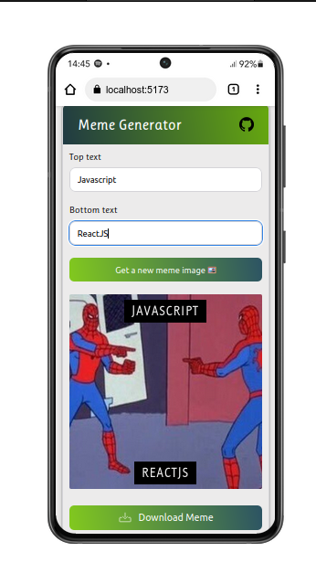

# Meme Generator

This is a simple web app that generates random memes using the Imgflip API. You can customize the text on the memes and download them as images.

## Features

- Generate random memes from Imgflip
- Customize the top and bottom text
- Download memes as images

## Screenshots




## Technologies Used

- React
- useState and useEffect hooks
- Imgflip API
- JavaScript Canvas API

## Installation

1. Clone the repository

```bash
git clone https://github.com/Oluwa-Laughter/meme-generator.git
```

2. Install dependencies

```bash
npm install
```

3. Start the development server

```bash
npm start
```

4. Open [http://localhost:3000](http://localhost:3000) to view it in the browser.

## Project Author:

- Website - [Isaac Makinde](https://github.com/Oluwa-Laughter)
- Twitter - [LAUGHTER](https://www.x.com/isaacmakinde_)
- LinkedIn - [Isaac Makinde](https://www.linkedin.com/in/isaacmakinde)
